在直流有刷电机的基础驱动中，如果电机负载不变，我们只要设置固定的占空比（电压），电机的速度就会稳定在目标范围。

然而，在实际的应用中，负载可能会发生变化，此时如果还是输出固定的电压，电机的速度就偏离目标范围了，为了解决这个问题，我们需要引入自动控制系统中的闭环控制。接下来我们开始学习自动控制系统的内容。

概念：用自动控制装置，对关键参数进行自动控制，使它在受到外界干扰而偏离正常状态时，能够被自动地调节回到目标范围内。

应用场景：电水壶保温系统、大棚温控系统、水位控制系统，等等。

分类：自动控制系统分为开环控制系统和闭环控制系统。

① 开环控制系统

在开环控制系统中，系统输出只受输入的控制，没有反馈回路，控制精度和抑制干扰的特性都比较差。

电风扇风力控制系统就是一个开环控制的系统，我们设置好目标风力之后，控制电路就输出相应的电压（假设是电压控制），此时电机的扇叶转速就被控制在目标范围了。

理想状态下，风扇的输出风力确实可以稳定在目标值附近，然而，在实际的使用中，电机会逐渐老化，扇叶上的灰尘也会让负载增大，此时我们所设定目标风力和实际风力可能就存在偏差了。

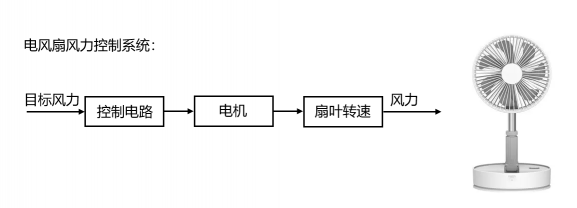

② 闭环控制系统

在闭环控制系统中，引入了反馈回路，利用输出（实际值）和输入（目标值）的偏差，对系统进行控制，避免偏离预定目标。

大棚温控系统就是一个闭环控制的系统，我们设置好目标温度之后，温度传感器会采集棚内的实际温度，然后将目标温度和实际温度进行偏差的计算，计算后的结果输入到控制电路中，控制电路进一步控制温控设备进行升温和降温，此时棚内的实际温度就被控制在目标范围了。

当实际温度因外部影响偏离目标值时，温度传感器（反馈电路）就能及时的反馈偏差，让系统自动调节温控设备，使得实际温度逐渐回到目标范围。

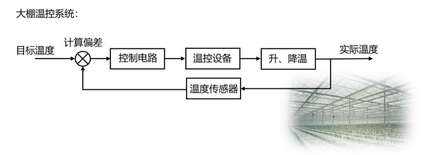

03PID 算法 match ‍ ‍

PID 算法是闭环控制系统中常用的算法，PID 分别是 Proportion（比例）、Integral（积分）、Differential（微分）的首字母缩写。它是一种结合比例、积分和微分三个环节于一体的闭环控制算法。

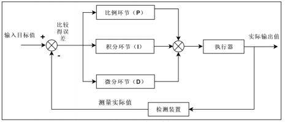

我们将输入目标值和实际输出值进行偏差的计算，然后把计算结果输入到 PID控制算法中，经过比例、积分和微分三个环节的运算，运算后的输出作用于执行器，从而让系统的实际值逐渐靠近目标值。

以大棚温控系统为例，来理解 PID 算法中三个环节的作用。

比例环节（ Proportion）

比例环节可以成比例地反应控制系统的偏差信号，即输出与输入偏差成正比，可以用来减小系统的偏差。公式如下：

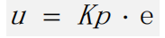

u —输出

Kp—比例系数

e —偏差

我们可以通过大棚温控去理解PID公式。例如需要调节棚内温度为 30℃，而实际温度为 10℃，此时的偏差 e=20，由比例环节的公式可知

当 e 确定时，Kp 越大则输出u 越大，也就是温控系统的调节力度越大，这样就可以更快地达到目标温度；而当 Kp 确定时，偏差 e 越大则输出 u 越大。

由此可见，在比例环节中，比例系数 Kp 和偏差 e 越大则系统消除偏差的时间越短

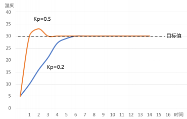

当 Kp 的值越大时，其对应的橙色曲线达到目标值的时间就越短，与此同时，橙色曲线出现了一定幅度的超调和振荡，这会使得系统的稳定性下降。

所以我们在设置比例系数的时候，并不是越大越好，而是要兼顾消除偏差的时间以及整个系统的稳定性。

在实际的应用中，如果仅有比例环节的控制，可能会给系统带来一个问题：静态误差。

静态误差是指系统控制过程趋于稳定时，目标值与实测值之间的偏差。

如果我们在需要调节棚内温度为 30℃，而实际温度为 25℃，此时偏差 e=5，Kp 为固定值，那么此时的输出可以让大棚在半个小时之内升温 5℃，而外部的温差可以让大棚在半个小时之内降温 5℃，也就是说，输出 u 的作用刚好被外部影响抵消了，这就使得偏差会一直存在。

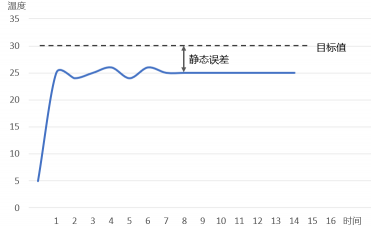

我们可以通过增大 Kp 来增大输出，以此消除偏差。在实际应用中，此方法的局限性很大，因为我们不能确定偏差的大小，它是在实时变化的，如果我们把 Kp 设置得太大，就会引入超调和振荡，让整个系统的稳定性变差。因此，为了消除静态误差，我们引入了积分环节。

积分环节（Integral）

积分环节可以对偏差 e 进行积分，只要存在偏差，积分环节就会不断起作用，主要用于消除静态误差，提高系统的无差度。

引入积分环节后，比例+积分环节的公式如下：

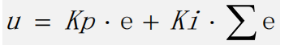

u —输出

e —偏差

∑e—累计偏差

Kp—比例系数

Ki—积分系数

通过以大棚温控分析可以知道，如果温控系统的比例环节作用被抵消，存在静态误差 5℃，此时偏差存在，积分环节会一直累计偏差，以此增大输出，从而消除静态误差。

从上述公式中可以得知，当积分系数 Ki 或者累计偏差越大时，输出就越大，系统消除静态误差的时间就越短。

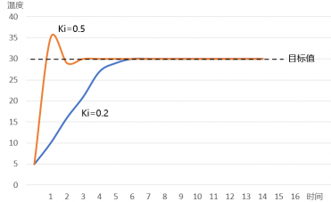

当Ki的值越大时，其对应的橙色曲线达到目标值的时间就越短，与此同时，橙色曲线出现了一定幅度的超调和振荡，这会使得系统的稳定性下降

因此，我们在设置积分系数的时候，并不是越大越好，而是要兼顾消除静态误差的时间以及整个系统的稳定性。

只要系统还存在偏差，积分环节就会不断地累计偏差。当系统偏差为 0的时候，说明已经达到目标值，此时的累计偏差不再变化，但是积分环节依旧在发挥作用（此时往往作用最大），这就很容易产生超调的现象了。

因此，我们需要引入微分环节，提前减弱输出，抑制超调的发生。

微分环节（Differential）

微分环节可以反应偏差量的变化趋势，根据偏差的变化量提前作出相应控制，减小超调，克服振荡。引入微分环节后，比例+积分+微分环节的公式如下：

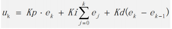

我们继续使用大棚温控去分析微分环节的作用。如果温控系统目标温度为 30℃，在上午八点的时候存在偏差15℃，经过一段时间的调节，到了上午九点，此时偏差已经缩小到5℃，偏差的变化量= 九点的偏差（第 k 次）-八点的偏差（第 k-1 次）= -10，结合上述公式可知，此时微分环节会削弱比例和积分环节的作用，减小输出以抑制超调。

最终得到了一个 PID算法公式：

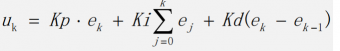

这个公式是 PID 离散公式之一，除了离散公式之外，PID 还有连续的公式，但是因为连续的公式不利于机器计算，我们一般不研究。每一个系统的 PID 系数并不是通用的，这需要根据实际的情况去设置。

04PID 算法离散公式

位置式 PID 公式
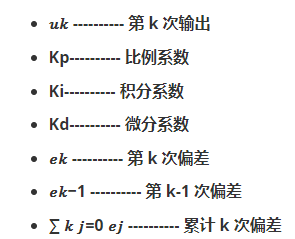


这个公式的计算需要全部控制量参与，它的每一次输出都和过去的状态有关。

增量式 PID 公式

通过位置式的 PID 公式，可推导出增量式 PID 公式

将 k = k-1 代入位置式 PID 公式


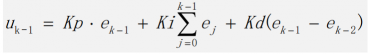
由
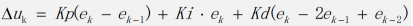

增量式 PID 可以看出，增量式 PID 的计算并不需要一直累计偏差，它的输出与近三次的偏差有很大关系。

注意：增量式 PID 公式输出的只是控制量的增量。假设电机实际转速为 50RPM，现在我们要让它加速到 60RPM，如果采用的是位置式 PID，系统将直接输出 60RPM 对应的控制量（占空比）；

如果采用的是增量式 PID，系统将输出提速 10RPM对应的控制量（占空比），此时我们还需要加上上次（50RPM）的输出。

两个 PID 公式的不同点

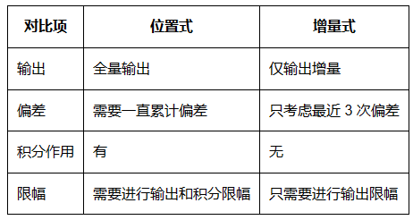

两种PID公式的优缺点

① 位置式：

优点：位置式 PID 是一种非递推式算法，带有积分作用，适用于不带积分部件的对象。

缺点：全量计算，计算错误影响很大；需要对偏差进行累加，运算量大。

② 增量式：

优点：只输出增量，计算错误影响小；不需要累计偏差，运算量少，实时性相对较好。

缺点：积分截断效应大，有稳态误差。

05积分饱和问题

在位置式 PID 中，如果系统长时间无法达到目标值，累计偏差（积分）就会变得很大，此时系统的响应就很慢了。

例如某个电机能达到的最大速度为 300RPM，而我们设置了目标速度为 350RPM，这明显是一个不合理的目

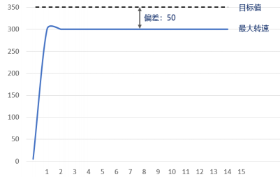

由于系统长时间无法达到目标值，累计偏差（积分）会变得越来越大，逐渐达到深度饱和的状态，此时我们再设置一个合理范围的目标速度（例如 200RPM），系统就没有办法在短时间内响应了。

为了避免位置式 PID 中可能出现的积分饱和问题，可以考虑下面解决方法：

①优化 PID 曲线，系统越快达到目标值，累计的偏差就越小；

②限制目标值调节范围，规避可以预见的偏差；

③进行积分限幅，在调整好 PID 系数之后，根据实际系统来选择限幅范围。

06PID算法代码实现

控制量相关的结构体

我们知道PID 的离散化公式后，实现 PID 算法的代码是非常简单。

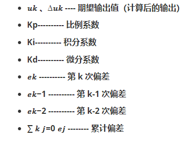

定义结构体来管理这些控制量

```c
typedef struct
{
 __IO float SetPoint; /* 目标值 */
 __IO float ActualValue; /* 期望输出值 */
 __IO float SumError; /* 偏差累计 */
 __IO float Proportion; /* 比例系数 P */
 __IO float Integral; /* 积分系数 I */
 __IO float Derivative; /* 微分系数 D */
 __IO float Error; /* Error[1],第 k 次偏差 */
 __IO float LastError; /* Error[-1],第 k-1 次偏差 */
 __IO float PrevError; /* Error[-2],第 k-2 次偏差 */
} PID_TypeDef;
```
PID 算法代码

位置式 PID 代码
```c
/*
* @brief pid 闭环控制
* @param *PID：PID 结构体变量地址
* @param Feedback_value：当前实际值
* @retval 期望输出值
*/
int32_t own_pid_ctrl(PID_TypeDef *PID,float Feedback_value)
{
  PID->Error = (float)(PID->SetPoint - Feedback_value); /* 计算偏差 */
  PID->SumError += PID->Error; /* 累计偏差 */
  PID->ActualValue = (PID->Proportion * PID->Error) /* 比例环节 */
  + (PID->Integral * PID->SumError) /* 积分环节 */
  + (PID->Derivative * (PID->Error - PID->LastError)); /* 微分环节 */
  PID->LastError = PID->Error; /* 存储偏差，用于下次计算 */
  return ((int32_t)(PID->ActualValue)); /* 返回计算后输出的数值 */
}
```

own_pid_ctrl 函数用来进行位置式 PID 的控制，该函数的 2 个形参：PID 传入 PID控制量相关的结构体地址；Feedback_value 传入当前系统的实际值，用于计算偏差。

在函数中，我们先计算本次偏差 Error，然后把偏差累计，存入 SumError 成员当中，接着根据位置式的公式进行三个环节的计算，计算后的期望输出存入 ActualValue 成员当中，然后存储本次偏差，最后返回期望输出值。

增量式 PID 代码

```c
/*
* @brief pid 闭环控制
* @param *PID：PID 结构体变量地址
* @param Feedback_value：当前实际值
* @retval 期望输出值
*/
int32_t own_pid_ctrl(PID_TypeDef *PID,float Feedback_value)
{
    PID->Error = (float)(PID->SetPoint - Feedback_value); /* 计算偏差 */
    PID->ActualValue += 
/* 比例环节 */
    (PID->Proportion * (PID->Error - PID->LastError)) 
/* 积分环节 */
    + (PID->Integral * PID->Error) 
/* 微分环节 */
    + (PID->Derivative * (PID->Error - 2 * PID->LastError + PID->PrevError)); 
    PID->PrevError = PID->LastError; /* 存储偏差，用于下次计算 */
    PID->LastError = PID->Error;
return ((int32_t)(PID->ActualValue)); /* 返回计算后输出的数值 */
}
```

增量式 PID 的代码实现和位置式是非常类似的，所以我们在实际的代码实现中，可以通过一个宏定义来切换这两种不同的算法，值得注意的是，增量式 PID 输出的是调节量，所以计算期望输出值 ActualValue 的时候是自增运算，这一点和位置式 PID 是不一样的。


