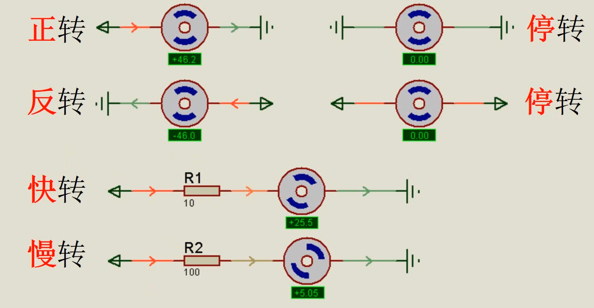
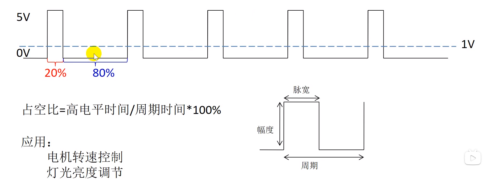
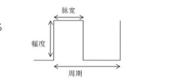
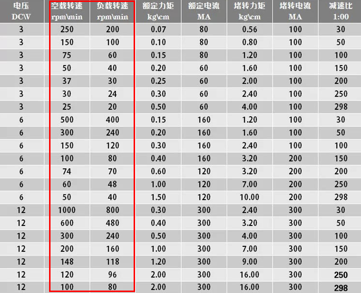

# 直流电机控制

对于普通的直流（有刷）电机，在其两个电极上接上合适的直流电源后，电机就可以满速转动，电源反接后，电机就反向转动。实际情况是我们要能控制电机的正反转，停止等状态以及电机的转速。

> 直流有刷电机是内含电刷装置的将直流电能转换成机械能(直流电动机)或将机械能转换成直流电能(直流发电机)的旋转电机。区别于直流无刷电机，电刷装置是用来引入或引出直流电压和直流电流的。

# 直流电机正反转及停止状态
当单片机输出高电平时，电机得电，从而满速运行；当单片机输出低电平时，电机两端没有电压，电机停止转动。
那如何使电机两端的电压发生变化，进而控制电机的转速呢？只要单片机输出占空比可调的方波，即PWM信号即可控制电机两端的电压发生变化，从而实现电机转速的控制。
> VCC（1）→信号1→电机→信号2→GND（0），实现了电机的正转。
GND（0）→信号1→电机→信号2→VCC（1），实现了电机的反转。
GND（0）→电机→ GND（0），停转
VCC（1）→电机→ VCC（1），停转
阻值小（PWM占空比大，平均电压大），转的快
阻值大（PWM占空比小，平均电压小），转的慢
PS：0和1代表低电平和高电平，PWM后面详细说明。

# 直流电机调速原理
可以通过改变电压来控制电机速度。
> 例如使用12V直流电机时候，给12V的电就满速转，给5V的电就是5/12的速度转

只要单片机输出占空比可调的方波，即PWM信号即可控制电机两端的电压发生变化，从而实现电机转速的控制。

> PWM输出的信号可以看成电压，而不是实际的电压，要注意！！

## PWM
上面说了，我们会用PWM调速，那么PWM是啥。

## PWM(Pulse Width Modulation)控制——脉冲宽度调制技术，通过对一系列脉冲的宽度进行调制，来等效地获得所需要波形(含形状和幅值)。其具有两个很重要的参数：频率和占空比。

## 频率
就是周期的倒数，单位Hz(赫兹)

周期=1/频率 100HZ就是10ms一个周期

如果设置的频率为100Hz，就是说也就是说一个周期是10ms 那么一秒钟就有 100次PWM周期

## 占空比
就是高电平在一个周期内所占的比例,单位 %（百分之）

直接看PWM方波的示意图，会比较容易理解。

首先看周期和脉宽表示:

> 脉宽（时间）:高电平时间
周期：一个脉冲信号的时间
（从幅度开始到下一个幅度前结束，高电平（脉宽）时间+低电平时间）

在上图中，频率F的值为1/(T1 T2)，占空比D的值为T1/(T1 T2)。通过改变单位时间内脉冲的个数可以实现调频；通过改变占空比可以实现调压。

> 占空比越大，所得到的平均电压也就越大，幅值也就越大；占空比越小，所得到的平均电压也就越小，幅值也就越小。

上图平均电压我们可以转化一下。即5V*20%+0V*80%=1V

如果是12V电机，占空比为30%，可以自行算平均电压了哦12V*30%+0V*70%=3.6V

注意：是相当于电压，实际还是信号

PWM对电机转速的控制
通过以上原理就可以知道，只要改变PWM信号的占空比，就可以改变直流电机两端的平均电压，从而实现直流电机的调速。

> 对于直流电机来讲，电机输出端引脚是高电平电机就可以转动，当输出端高电平时，电机会转动，但速度是一点一点提升的，在高电平突然转向低电平时，电机由于电感有防止电流突变的作用是不会停止的，会保持这原有的转速，以此往复，电机的转速就是周期内输出的平均电压值，所以实质上我们调速是将电机处于一种，似停非停，似全速转动又非全速转动的状态，那么在一个周期的平均速度就是我们占空比调出来的速度了。

在电机控制中，电压越大，电机转速越快，而通过PWM输出不同的模拟电压，便可以使电机达到不同的输出转速当然，在电机控制中，不同的电机都有其适应的频率 频率太低会导致运动不稳定，如果频率刚好在人耳听觉范围，有时还会听到呼啸声。

比如我在某宝上看到的电机信息如下

我现在选择12V 300转的电机，我频率要怎么设置。（这里为理论，后续要自己做调整。）

有公式哦-
> 电机转速与频率公式：n=60f/p
n——电机转速
60——每分钟（秒）
f——电源频率
p——极对数（我们用在创客中的这种小马达默认为1也就是3000）

转换一下就可以通过转速求我们应设置的频率了
>  f=np/60
我们之前选的300转，可以求我们应设置的频率了

f=300*3000/60
f=900000/60
f=15000Hz

注意：以上都为理论值，实际情况可能会很复杂，比如电压（这里是按照给的电压来算的，实际可能提供不了这么高的电压。），使用的驱动芯片之类的。这里只是做一个参考，因为实战发现，按需调整频率是个细活！——频率太高电机可能反应不过来，低了又驱动不起来。谨以此参考，后续需要朋友们慢慢去调试。！

> 参考资料
《第19讲-直流电机之PWM控制》https://www.bilibili.com/video/BV1YZ4y1G7XF?spm_id_from=333.337.search-card.all.click
《PWM是如何调节直流电机转速的？电机正反转的原理又是怎样的？》https://www.360kuai.com/pc/96a3f78ab739d0fc9?cota=3&kuai_so=1&sign=360_57c3bbd1&refer_scene=so_1
《PWM原理 PWM频率与占空比详解》
https://blog.csdn.net/as480133937/article/details/103439546/
《 pwm对电机的影响》
https://blog.csdn.net/zhuimeng_ruili/article/details/117432812
《 电机转速和频率关系》
https://wenku.so.com/d/41088974a04a3c07960a9406fa90ce90

