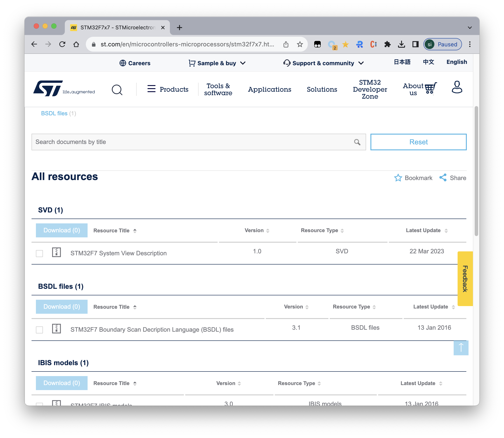

# STM32 SVD 文件

[[STM32 官网提供的文件]](https://www.st.com/en/microcontrollers-microprocessors/stm32f7x7.html#cad-resources)

> SVD 文件的全称是 "System View Description"。在嵌入式系统中，SVD 文件通常用于描述芯片的寄存器映射、寄存器位域以及其他与硬件相关的信息。在 STM32 微控制器的上下文中，SVD 文件包含了有关于 STM32 芯片系列的详细描述，包括寄存器映射、外设功能和特性等信息。
