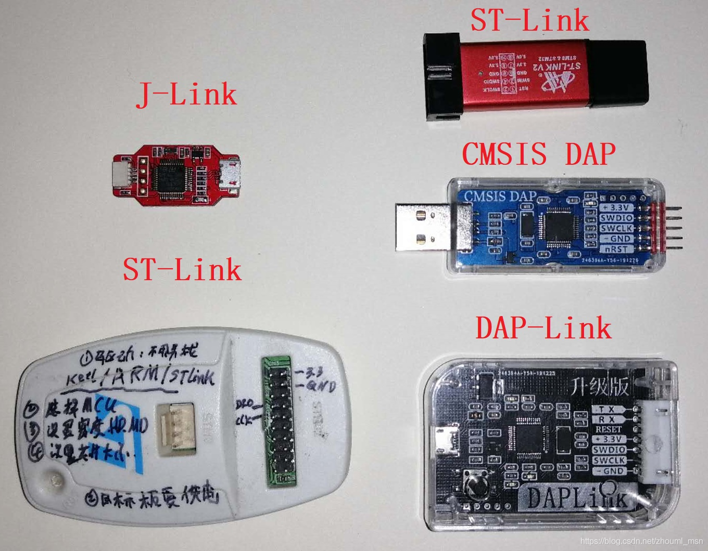

## JLink
> 最有名气、各种渠道版本最多，号称支持芯片量最多。但记得不要挑图中左上角这种版本，总感觉不结实把它捏坏了。
适合场景：如果项目文件比较大，首选！下载又快又稳，仿真调试也是杠杠的神器。

* 优点：最快、稳如老狗。STM32F407芯片+109K代码实测8秒完成烧录过程，图中几款中，数它最快。
* 缺点：最贵，和谐版都四五十元起步，正版上至数千元。注意： V9版本以下的J-Link大多数不支持STM8。
  
## STLink
> 随着STM32这十年八年的垄断，ST-Link也跟着发大火了, 妥妥销量一哥。
适合场景：学校里开STM32课程的，几乎每个宿舍都有吧~
* 优点：便宜、便宜，便宜！ x宝13元包邮。特别注意一下：驱动包就在KEIL本身的文件夹里头，你说它多火。
* 缺点：不够稳定! 可能不时的来个弹窗。

## CMSIS DAP  
> 软硬件开源！这两三年，含量在火箭式起飞。很多人知道它是因为技小新和立创EDA的开源工程。比STLink稍贵。
适合场景：玩stm32的，这个是最优选择。

* 优点：开源、虚拟串口、免驱。大爱的虚拟串口，很爽、很爽, (有些下载器也有虚拟串口)，更爱它开源没心病~~。
* 缺点：真没啥缺点，能拼JLink的稳定, 也能拼ST-Link的便宜，还没版权问题！ 109K代码烧录实测10秒，也算杠杠的吧。

## DAPLink
> CMSIS-DAP的升级版。
适合场景：嗯，如果你的动手能力高超，这个最合适，软硬都开源，可玩性极高，比如做个拖拽的脱机下载......
* 优点：拖拽烧录、升级固件。包括了CMSIS-DAP的优点：开源+虚拟串口+免驱。
* 缺点：不要买图中右下角这款，你会发觉很不顺手，挡视线，接杜绑线时很怕接错，中看不中用，手头两个都进了冷宫。

  
  
